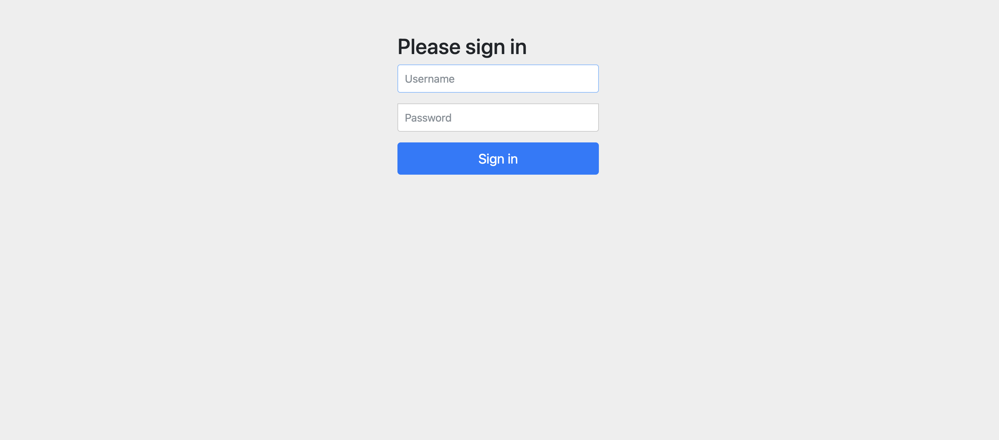
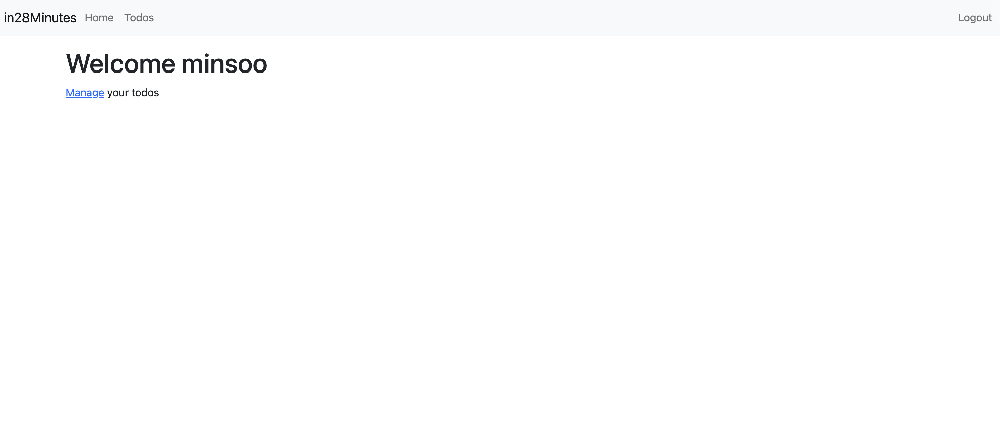
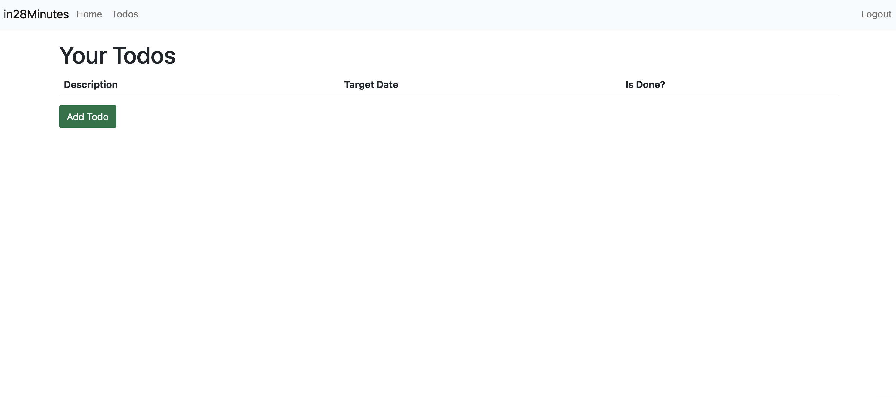
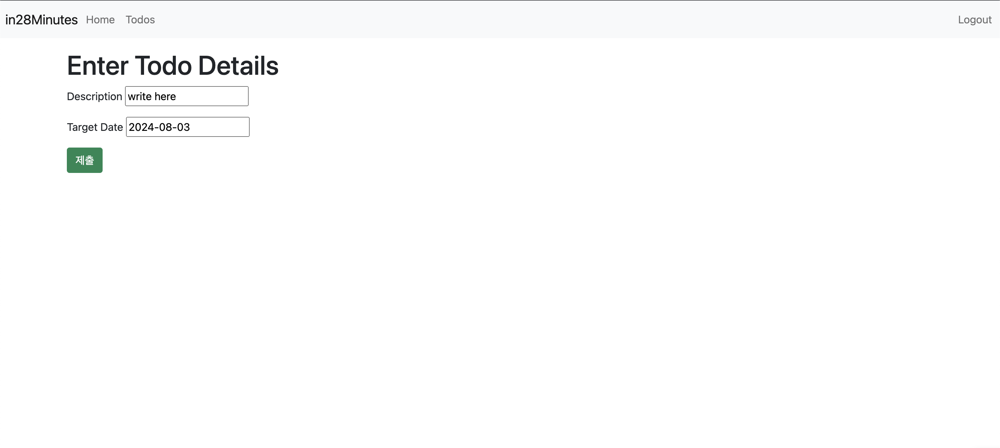
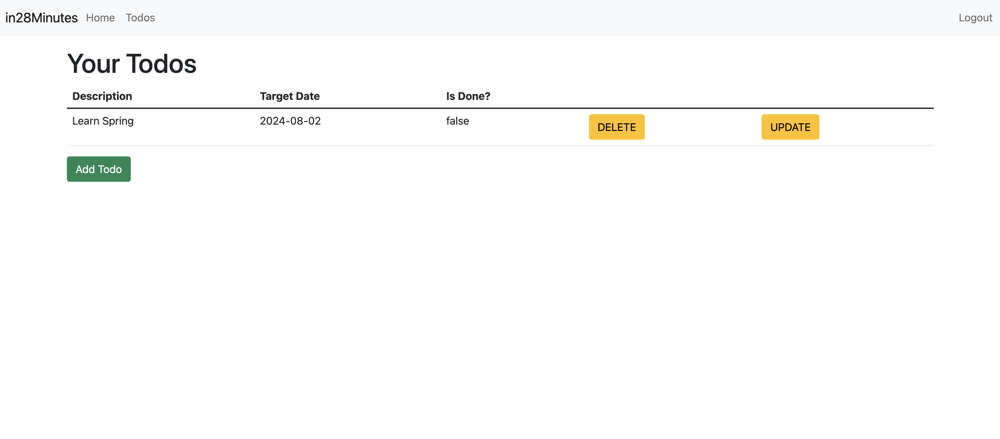

## todo web app
- Spring MVC패턴을 이용하여 todo를 작성할 수 있는 앱 개발

## 결과
- login

- login하면 welcome

- todo를 manage할 수 있는 페이지 (mysql 테이블에서 username에 해당하는 todos)

- todo 작성

- todo 추가 완료



- docker mysql container 띄우는 명령어
```bash
docker run --detach \
--env MYSQL_ROOT_PASSWORD=dummypassword \
--env MYSQL_USER=todos-user \
--env MYSQL_PASSWORD=dummytodos \
--env MYSQL_DATABASE=todos \
--name mysql \
--publish 3306:3306 mysql:8-oracle
```